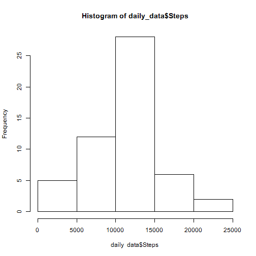
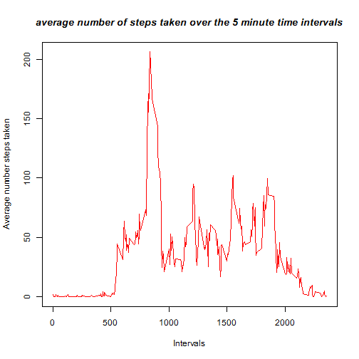
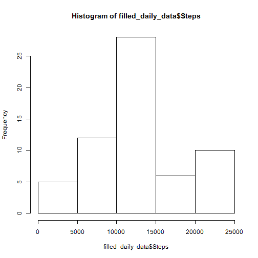

## *** 1.0 Loading and preprocessing the data
### Step 1.1 Read in the CSV file into memory

```r
raw_data<-read.csv("activity.csv",
                  as.is=TRUE,
                         na.strings = "NA")
str(raw_data)
```

```
## 'data.frame':	17568 obs. of  3 variables:
##  $ steps   : int  NA NA NA NA NA NA NA NA NA NA ...
##  $ date    : chr  "2012-10-01" "2012-10-01" "2012-10-01" "2012-10-01" ...
##  $ interval: int  0 5 10 15 20 25 30 35 40 45 ...
```


### Create a dataframe of steps by data and give meaningfull names to columns

```r
daily_data<-aggregate(raw_data$steps,by=list(as.Date(raw_data$date)),FUN=sum)
names(daily_data)<-c("Date","Steps")
str(daily_data)
```

```
## 'data.frame':	61 obs. of  2 variables:
##  $ Date : Date, format: "2012-10-01" "2012-10-02" ...
##  $ Steps: int  NA 126 11352 12116 13294 15420 11015 NA 12811 9900 ...
```


## 2.0 What is mean total number of steps taken per day?
### Step 2.1:  make a histogram of the total number of steps taken each day


```r
hist(daily_data$Steps)
```

 

### Step 2.2 Then Using dataframe which aggregrates steps by Date (above), Calculate and report the mean and median of the total number of steps taken per day


```r
mean_daily_steps<-mean(daily_data$Steps,na.rm=TRUE)
median_daily_steps<-median(daily_data$Steps,na.rm=TRUE)
mean_daily_steps
```

```
## [1] 10766.19
```

```r
median_daily_steps
```

```
## [1] 10765
```

## 3.0 What is the average daily activity pattern?

### Step 3.1 Create a dataframe of average steps by interval and give meaningfull names to columns. Remebr to treat the NA values - in this case omit them.

```r
interval_data<-aggregate(raw_data$steps,by=list(raw_data$interval),FUN=mean,na.rm=TRUE)
names(interval_data)<-c("interval","AvgSteps")
str(interval_data)
```

```
## 'data.frame':	288 obs. of  2 variables:
##  $ interval: int  0 5 10 15 20 25 30 35 40 45 ...
##  $ AvgSteps: num  1.717 0.3396 0.1321 0.1509 0.0755 ...
```
### Step 3.2 Make a time series plot (i.e. type = "l") of the 5-minute interval (x-axis) and the average number of steps taken, averaged across all days (y-axis)

```r
plot(interval_data$interval,interval_data$AvgSteps, xlab= "Intervals", ylab= "Average number steps taken", type='l', col='red') 
title(main="average number of steps taken over the 5 minute time intervals", col.main="black", font.main=4)
```

 
### Step 3.3 determine Which 5-minute interval, on average across all the days in the dataset, contains the maximum number of steps?

```r
interval_data[which.max(interval_data$AvgSteps),1]
```

```
## [1] 835
```

## 4.0 Inputing missing values
### Step 4.1  Calculate and report the total number of missing values in the dataset

```r
sum(is.na(raw_data$steps))
```

```
## [1] 2304
```


### Step 4.2  Create new dataset by filling in missing values using the mean for the 5 minute interval. Simpistic method of assigning that all to value 75 which is an average from lookin at earlier plot.

```r
treated_raw_data<-raw_data
treated_raw_data[is.na(treated_raw_data),"steps"] <-75
```


### Step 4.3:  make a histogram of the total number of steps taken each day. need to re-aggregate the filled data by day and calculate mean as before. Report out the mean and median.

```r
filled_daily_data<-aggregate(treated_raw_data$steps,by=list(as.Date(treated_raw_data$date)),FUN=sum)
names(filled_daily_data)<-c("Date","Steps")
str(filled_daily_data)
```

```
## 'data.frame':	61 obs. of  2 variables:
##  $ Date : Date, format: "2012-10-01" "2012-10-02" ...
##  $ Steps: num  21600 126 11352 12116 13294 ...
```

```r
filled_mean_daily_steps<-mean(filled_daily_data$Steps,na.rm=TRUE)
filled_median_daily_steps<-median(filled_daily_data$Steps,na.rm=TRUE)
filled_mean_daily_steps
```

```
## [1] 12187.02
```

```r
filled_median_daily_steps
```

```
## [1] 11458
```

```r
hist(filled_daily_data$Steps)
```

 
#### Do these values differ from the estimates from the first part of the assignment? 
##### They do not appear to. 
#### What is the impact of imputing missing data on the estimates of the total daily number of steps?
##### negligible.

## 5.0 Are there differences in activity patterns between weekdays and weekends?
### Yes, it would appear there is more activity on weekends, esp Saturdays. this is bourne out by separating the weekdays from the weekend days.


